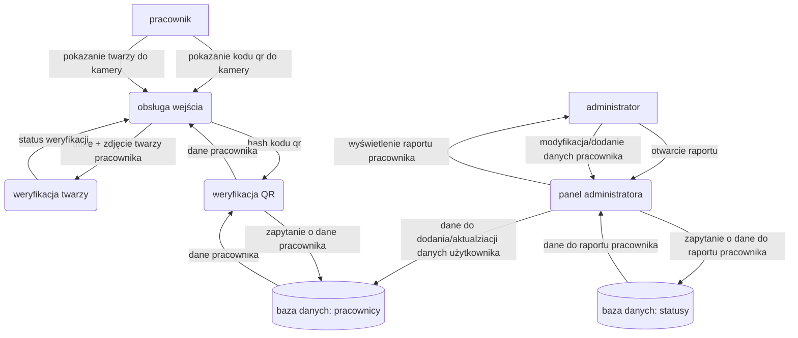

# Dokumentacja inżynierii wymagań

  

Członkowie zespołu:

-   Karol Arabasz
    
-   Tomasz Larysz
    
-   Maksym Ząbroń
    

  

### 1. Macierz kompetencji zespołu

  

| Kompetencje | Karol Arabasz | Tomasz Larysz | Maksym Ząbroń |
| --- | --- | --- | --- |
| Programowanie Python | Posiada | Posiada (podstawy) | Posiada(Podstawy) |
| Technologie webowe | Posiada (podstawy) | Posiada | Posiada |
| Testowanie oprogramowania | Posiada (podstawy) | Posiada (podstawy) | Posiada(Podstawy) |
| Bazy danych | Posiada | Posiada | Posiada(Podstawy) |
| Technologie rozpoznawania obrazów | Nie posiada | Nie posiada | Nie posiada |
| Zarządzanie zespołem | Posiada (podstawy) | Posiada (podstawy) | Posiada |

  
  
  
  
  
  
  
  
  
  
  
  
  

### 2. Zestaw pytań, które zostały zadane w celu uszczegółowienia zadanego projektu

  

| Pytanie | Odpowiedź |
| --- | --- |
| Ile ma wynosić czas przetwarzania? | Do 5 sekund |
| Jaka ma być trafność rozpoznawania? | 90% |
| Ile pracowników musi zawierać baza? | Minimum 20 |
| Jaki rodzaj kamery będzie wykorzystywany? | Dowolna kamera |
| Jak pracownik będzie otrzymywał kod QR? | Kod będzie drukowany |
| Czy kod QR będzie miał termin ważności? | Tak |
| Jak mają być raportowane wyjścia i wejścia? | Wypisane w pliku txt, poprawne/niepoprawne z możliwością wyświetlenia i pobrania |
| Co się składa na panel administracyjny? | 1. Zarządzanie pracownikami - dodanie nowego pracownika (imię, nazwisko, zdjęcie), aktualizacja danych pracownika (imię, nazwisko, zdjęcie), usuwanie pracownika<br> 2. Pobieranie, udostępnianie kodu QR pracownika <br> 3. Zmiana terminów ważności kodów QR pracownika <br> 4. Przegląd zarejestrowanych pracowników <br> 5. Przegląd zarejestrowanych prób wejść i wyjść pracowników <br> 6. Pobieranie raportu wejść i wyjść pracownika <br>

### 3. Format danych wejściowych i ich struktury

| Nazwa pola | Typ danych | Wymagalność | Opis |
| --- | --- | --- | --- |
| Obraz z kamery | Strumień wideo (klatki) | Wymagane | Ciągły strumień klatek obrazu (min. 640x480px) służący do detekcji QR i twarzy. |
| Kod QR | Ciąg znaków (String) | Wymagane | Rozpoznany w klatce wideo ciąg znaków (UUID), identyfikujący pracownika. |
| Obraz twarzy | Macierz pikseli | Wymagane | Wykadrowany z klatki fragment obrazu zawierający twarz, przekazywany do modelu biometrycznego. |
| Identyfikator pracownika | Liczba całkowita (Integer) | Wymagane | Unikalny numer ID pracownika w bazie danych, powiązany z kodem QR. |
| Wektor cech twarzy (Embedding) | Lista liczb zmiennoprzecinkowych | Wymagane | Reprezentacja matematyczna twarzy (np. 128-wymiarowa), służąca do porównań. |

### 4. Dane przechowywane dla każdego pracownika

| Nazwa Pola / Atrybutu | Typ Danych | Opis |
| --- | --- | --- |
| id | Integer | Unikalny identyfikator numeryczny pracownika (Klucz Główny). |
| first_name | String | Imię pracownika. |
| last_name | String | Nazwisko pracownika. |
| photo_path | String | Ścieżka do pliku ze zdjęciem pracownika. |
| qr_hash | String (Hash/UUID) | Unikalny identyfikator (hash) kodu QR. |
| qr_expiration_date | Date | Data ważności kodu QR. |
| vector_features | Array / List [Float] | Wektor cech biometrycznych twarzy. |
| plik_zdjęcia (na dysku) | Image File | Fizyczny plik graficzny ze zdjęciem pracownika (JPG/PNG). |
| plik_kod_qr (na dysku) | Image File | Fizyczny plik graficzny z wygenerowanym kodem QR (PNG). |

### 5. Dane przechowywane dla każdego zdarzenia (logi)

| Nazwa Pola / Atrybutu | Typ Danych | Opis |
| --- | --- | --- |
| id | Integer | Unikalny identyfikator zdarzenia (Klucz Główny). |
| event_time | DateTime | Data i godzina wystąpienia zdarzenia. |
| employee_id | Integer | Identyfikator pracownika powiązanego ze zdarzeniem. |
| status | Boolean | Wynik weryfikacji (Prawda = Sukces, Fałsz = Porażka). |
| reason | String | Opis powodu odrzucenia lub statusu (opcjonalne). |


### 6. Model systemu


<!-- | Aktor | Scenariusz / Cel | Dane Wejściowe | Wyzwalacz | Odpowiedź Systemu | Uwagi |
| --- | --- | --- | --- | --- | --- |
| **Pracownik** | **Weryfikacja tożsamości (Wejście/Wyjście/Sprawdzenie)** | Obraz wideo (QR + Twarz) | Pracownik pokazuje kod QR do kamery, w przypadku poprawnego kodu QR system próbuje rozpoznać twarz pokazaną do kamery. | **Sukces:** Komunikat "Identity Verified", zielona ramka, log "True".<br>**Porażka:** Komunikat błędu (np. "Access Denied"), czerwona ramka, log "False". | System działa w pętli: ciągła detekcja QR, następnie próba rozpoznania twarzy w określonym czasie. |
| **Administrator** | **Dodanie pracownika** | Formularz: Imię, Nazwisko, Plik zdjęcia (JPG/PNG). | Kliknięcie "Add Employee" w panelu webowym. | Utworzenie rekordu w DB, wygenerowanie hasha QR, zapisanie plików, obliczenie wektora twarzy. | Wymagana walidacja czy zdjęcie zawiera twarz. |
| **Administrator** | **Edycja pracownika** | Zmodyfikowane dane (Imię/Nazwisko/Zdjęcie). | Kliknięcie "Edit" na liście pracowników. | Aktualizacja rekordu DB. Jeśli zmieniono zdjęcie -> przeliczenie wektora. | Możliwość aktualizacji samego zdjęcia bez zmiany danych osobowych. |
| **Administrator** | **Usunięcie pracownika** | ID Pracownika. | Kliknięcie "Delete" w panelu. | Usunięcie rekordu z DB oraz powiązanych plików z dysku. | Akcja nieodwracalna. Kaskadowe usuwanie logów. |
| **Administrator** | **Przegląd logów** | Filtry (opcjonalnie). | Wejście w zakładkę "Logs". | Wyświetlenie tabeli z historią wejść/wyjść (Czas, Status, Kto). | Logi są tylko do odczytu. | -->


## Przedstawienie modelowanego systemu za pomocą diagramów

### Diagram sekwencyjny UML


### Diagram Przepływu Danych




### 7. Szczegółowy opis działania systemu

**1. Wykrywanie i weryfikacja kodu QR**
Gdy pracownik zbliża się do stanowiska weryfikacyjnego, prezentuje swój unikalny kod QR (wydrukowany lub na ekranie telefonu) do kamery. System, wykorzystując bibliotekę **OpenCV**, analizuje każdą klatkę strumienia wideo. W momencie wykrycia wzorca QR, następuje jego odczytanie i zdekodowanie do postaci ciągu znaków (hash/UUID).
Aplikacja natychmiast odpytuje bazę danych **PostgreSQL**, sprawdzając:
a) Czy dany hash istnieje w tabeli `employees`.
b) Czy data ważności kodu (`qr_expiration_date`) nie została przekroczona.
Jeśli kod jest nieznany lub przeterminowany, proces zostaje przerwany z komunikatem błędu.

**2. Biometryczna weryfikacja twarzy (Face Auth)**
Po pomyślnej walidacji kodu QR, system przechodzi w tryb weryfikacji tożsamości. Wykorzystując bibliotekę **face_recognition** (opartą na `dlib`):
1.  **Detekcja:** Z bieżącego strumienia wideo wyodrębniany jest obszar twarzy.
2.  **Generowanie Embedingu:** Algorytm przetwarza obraz twarzy na wektor cech (embedding) – listę 128 liczb zmiennoprzecinkowych unikalną dla danej osoby.
3.  **Porównanie:** Wygenerowany wektor jest porównywany z wektorem wzorcowym (`vector_features`) pobranym z bazy danych. Porównanie opiera się na metryce odległości euklidesowej.

**3. Decyzja i interfejs użytkownika**
System podejmuje decyzję na podstawie odległości wektorów:
*   **Weryfikacja pozytywna (Match):** Jeśli odległość jest mniejsza niż ustalony próg (domyślnie 0.6), system wyświetla komunikat o sukcesie ("Identity Verified") oraz wizualne potwierdzenie.
*   **Weryfikacja negatywna:** Jeśli odległość jest większa, system blokuje dostęp, wyświetlając komunikat o błędzie ("Face Mismatch").

**4. Rejestracja zdarzeń (Logowanie)**
Każda próba weryfikacji (zarówno udana, jak i nieudana) jest trwale zapisywana w tabeli `verification_logs`. Wpis zawiera:
*   Dokładny znacznik czasu (`event_time`).
*   Identyfikator pracownika (jeśli udało się odczytać QR).
*   Status operacji (Boolean).
*   Powód odrzucenia (w przypadku niepowodzenia, np. "QR Expired", "Face Mismatch").
Umożliwia to pełną audytowalność procesu wejścia/wyjścia.

**5. Panel Administracyjny i zarządzanie danymi**
Administrator zarządza systemem poprzez interfejs webowy (Frontend w **React** komunikujący się z API **FastAPI**).
*   **Rejestracja pracownika:** Administrator wprowadza dane osobowe i przesyła plik ze zdjęciem pracownika. System backendowy automatycznie generuje unikalny kod QR, zapisuje zdjęcie na dysku (`photo_path`) oraz oblicza i zapisuje w bazie wektor cech twarzy (`vector_features`) niezbędny do późniejszej weryfikacji.
*   **Zarządzanie kodami QR:** Kody QR są generowane jako pliki graficzne, które administrator może pobrać z panelu i przekazać pracownikowi (np. wydrukować).
*   **Raportowanie:** Administrator ma wgląd w historię zdarzeń poprzez tabelaryczny widok logów, co pozwala na monitorowanie czasu pracy i wykrywanie prób nieautoryzowanego dostępu.


# 1. QR Module

## Przegląd
Moduł QR zapewnia funkcjonalność generowania i skanowania kodów QR. Obecnie używa lokalnej bazy SQLite do testów, ale został zaprojektowany tak, aby łatwo podpiąć go do większej bazy danych projektu.

---

## Struktura Plików

```
QR/
├── generator.py     # Generowanie kodów QR
├── scanner.py       # Skanowanie kodów QR za pomocą kamery
├── remover.py       # Usuwanie kodów QR (przez skanowanie)
├── database.py      # [TYMCZASOWE] Lokalna baza SQLite do testów
├── main.py          # Interfejs CLI do testowania
└── qr_codes.db      # [TYMCZASOWE] Baza testowa
```

---

## Główne Funkcje Modułu

### 1. generator.py - Generowanie Kodów QR

#### `generate_qr_code()`
**Opis:** Generuje nowy unikalny identyfikator UUID, zapisuje go do bazy danych i tworzy obraz kodu QR.

**Parametry:** Brak

**Zwraca:**
- `filename` (str) - Nazwa pliku wygenerowanego obrazu (format: `qr_<uuid>.png`)
- `None` - Jeśli zapis do bazy danych się nie powiódł

**Skutki:**
- Tworzy plik PNG z kodem QR w bieżącym katalogu
- Zapisuje UUID do bazy danych (obecnie SQLite, później do głównej bazy)
- Wyświetla komunikaty w konsoli

**Przykład użycia:**
```python
import generator

filename = generator.generate_qr_code()
if filename:
    print(f"Kod QR zapisany jako: {filename}")
    # filename zawiera nazwę pliku, np. "qr_53b4cd8d-31f1-4e34-a7d1-35f831fb2662.png"
else:
    print("Błąd generowania kodu")
```

**Parametry kodu QR:**
- `version=1` - Rozmiar kodu QR (1 = najmniejszy)
- `error_correction=ERROR_CORRECT_L` - Niski poziom korekcji błędów
- `box_size=10` - Rozmiar każdego "pudełka" w pikselach
- `border=4` - Szerokość obramowania

---

### 2. scanner.py - Skanowanie Kodów QR

#### `scan_qr_code()`
**Opis:** Otwiera kamerę, skanuje kod QR i weryfikuje go w bazie danych.

**Parametry:** Brak

**Zwraca:** Brak (funkcja działa do momentu wykrycia kodu lub naciśnięcia 'q')

**Zachowanie:**
1. Otwiera kamerę (VideoCapture(0))
2. Wyświetla podgląd kamery w oknie "QR Code Scanner"
3. Ciągle skanuje w poszukiwaniu kodu QR
4. Po wykryciu kodu:
   - Weryfikuje kod w bazie danych
   - Jeśli kod istnieje: wyświetla "SUCCESS" i kończy
   - Jeśli kod nie istnieje: wyświetla "PERMISSION DENIED" i kontynuuje skanowanie
5. Użytkownik może nacisnąć 'q', aby zakończyć

**Przykład użycia:**
```python
import scanner

# Blokująca funkcja - zatrzyma wykonanie do momentu zeskanowania kodu
scanner.scan_qr_code()
```

---

### 3. remover.py - Usuwanie Kodów QR

#### `remove_qr_code()`
**Opis:** Otwiera kamerę, skanuje kod QR i usuwa go z bazy danych jeśli istnieje.

**Parametry:** Brak

**Zwraca:** Brak (funkcja działa do momentu wykrycia i usunięcia kodu lub naciśnięcia 'q')

**Zachowanie:**
1. Otwiera kamerę (VideoCapture(0))
2. Wyświetla podgląd kamery w oknie "QR Code Remover"
3. Ciągle skanuje w poszukiwaniu kodu QR
4. Po wykryciu kodu:
   - Jeśli kod istnieje: usuwa go i wyświetla "SUCCESS"
   - Jeśli kod nie istnieje: wyświetla komunikat i kontynuuje skanowanie
5. Użytkownik może nacisnąć 'q', aby zakończyć

**Przykład użycia:**
```python
import remover

remover.remove_qr_code()
```

---

## Integracja z Główną Bazą Danych

Obecnie moduł używa `database.py` z lokalną bazą SQLite do testów. Aby podpiąć moduł do głównej bazy danych projektu, wystarczy zastąpić wywołania funkcji z `database.py` innymi funkcjami.

Funkcje do Zastąpienia:

Moduł QR używa 4 funkcji z `database.py`:

#### 1. `database.init_db()`
**Gdzie używane:** generator.py, scanner.py, remover.py  
**Co robi:** Inicjalizuje bazę danych  
Do usunięcia w dalszej części produkcji

#### 2. `database.save_code(code_id)`
**Gdzie używane:** generator.py  
**Co robi:** Zapisuje UUID kodu QR do bazy  
**Parametry:** `code_id` (str) - UUID do zapisania  
**Zwraca:** `True` jeśli sukces, `False` jeśli błąd  

#### 3. `database.verify_code(code_id)`
**Gdzie używane:** scanner.py, remover.py  
**Co robi:** Sprawdza czy kod istnieje w bazie  
**Parametry:** `code_id` (str) - UUID do weryfikacji  
**Zwraca:** `True` jeśli kod istnieje, `False` jeśli nie  

#### 4. `database.delete_code(code_id)`
**Gdzie używane:** remover.py  
**Co robi:** Usuwa kod z bazy  
**Parametry:** `code_id` (str) - UUID do usunięcia  
**Zwraca:** `True` jeśli usunięto, `False` jeśli nie istniał  

---


## Zależności

```
qrcode==7.4.2
opencv-python==4.8.1.78
pillow==10.1.0
```

Instalacja:
```bash
pip install -r requirements.txt
```

---

### Uwagi:
- Funkcje skanujące są **blokujące** i powinny być uruchamiane w wątkach
- Obrazy QR są zapisywane w bieżącym katalogu
- UUID kodów QR to standardowe UUID v4 (36 znaków)


---

# Dokumentacja Modułu `face_auth`

Moduł `face_auth` odpowiada za uwierzytelnianie użytkowników na podstawie rozpoznawania twarzy. Wykorzystuje bibliotekę `face_recognition` (opartą na `dlib`) do generowania i porównywania wektorów cech twarzy oraz `OpenCV` do obsługi kamery i przetwarzania obrazu.

## Struktura Modułu

Moduł składa się z następujących plików:
- `admin.py`: Funkcje administracyjne do zarządzania danymi biometrycznymi pracowników.
- `authenticator.py`: Główna logika uwierzytelniania użytkownika.
- `camera.py`: Obsługa kamery internetowej.
- `recognizer.py`: Wrapper na bibliotekę `face_recognition` do rozpoznawania twarzy.

---

## 1. `admin.py`

Zawiera funkcje pomocnicze do rejestracji i aktualizacji danych biometrycznych pracowników.

### Funkcje

#### `upsert_employee_from_photo(photo_path, employee_id, first_name=None, last_name=None, qr_hash=None)`

Aktualizuje lub wstawia wektor twarzy pracownika na podstawie dostarczonego zdjęcia.

- **Parametry:**
  - `photo_path` (str): Ścieżka do pliku ze zdjęciem.
  - `employee_id` (int): ID pracownika.
  - `first_name` (str, opcjonalnie): Imię (wymagane dla nowego pracownika).
  - `last_name` (str, opcjonalnie): Nazwisko (wymagane dla nowego pracownika).
  - `qr_hash` (str, opcjonalnie): Hash QR (wymagane dla nowego pracownika).

- **Zwraca:**
  - `str`: Komunikat o wyniku operacji ("Updated", "Created", "Not Found", "Error" lub szczegóły błędu).

---

## 2. `authenticator.py`

Zawiera klasę `FaceAuthenticator`, która zarządza procesem weryfikacji tożsamości użytkownika.

### Klasa `FaceAuthenticator`

#### `__init__()`
Inicjalizuje instancję `FaceRecognizer`.

#### `ensure_user_has_vector(user_id)`
Sprawdza, czy użytkownik posiada wektor twarzy w bazie danych. Jeśli nie, próbuje go wygenerować na podstawie zapisanego zdjęcia (`photo_path`).

- **Parametry:**
  - `user_id` (int): ID użytkownika do sprawdzenia.

- **Zwraca:**
  - `(numpy_array, str)`: Krotka zawierająca wektor twarzy (jeśli sukces) lub `None`, oraz komunikat błędu (jeśli wystąpił) lub `None`.

#### `verify_user(user_id, timeout=10)`
Weryfikuje, czy osoba przed kamerą to użytkownik o podanym `user_id`. Uruchamia podgląd z kamery i porównuje twarz w czasie rzeczywistym.

- **Parametry:**
  - `user_id` (int): ID użytkownika do weryfikacji.
  - `timeout` (int, domyślnie 10): Czas w sekundach, po którym weryfikacja zostanie przerwana, jeśli nie uda się dopasować twarzy.

- **Zwraca:**
  - `(bool, str)`: Krotka `(True, "Verification successful.")` jeśli weryfikacja się powiodła, w przeciwnym razie `(False, komunikat_błędu)`.

---

## 3. `camera.py`

Obsługuje interakcję z kamerą internetową. Implementuje protokół Context Manager (`with Camera() as cam:`).

### Klasa `Camera`

#### `__init__(camera_index=0)`
Konstruktor klasy.
- **Parametry:**
  - `camera_index` (int, domyślnie 0): Indeks urządzenia kamery.

#### `start()`
Uruchamia przechwytywanie obrazu z kamery. Rzuca wyjątek `RuntimeError`, jeśli nie można otworzyć kamery.

#### `get_frame()`
Pobiera pojedynczą klatkę z kamery.
- **Zwraca:**
  - `numpy.ndarray`: Obraz klatki z kamery.

#### `stop()`
Zwalnia zasoby kamery.

---

## 4. `recognizer.py`

Wrapper na bibliotekę `face_recognition`, dostarczający uproszczony interfejs do generowania embeddingów i porównywania twarzy.

### Klasa `FaceRecognizer`

#### `__init__()`
Inicjalizuje klasę i wypisuje komunikat o użyciu biblioteki `face_recognition`.

#### `get_face_encoding(image)`
Oblicza embedding (wektor cech) dla pierwszej twarzy wykrytej na obrazie.

- **Parametry:**
  - `image` (numpy.ndarray): Obraz wejściowy (BGR, format OpenCV).

- **Zwraca:**
  - `list` lub `None`: Lista floatów (128-wymiarowa) reprezentująca wektor twarzy, lub `None` jeśli nie wykryto twarzy.

#### `compare_faces(known_vector, unknown_vector, threshold=0.6)`
Porównuje znany wektor twarzy z nieznanym wektorem używając odległości euklidesowej.

- **Parametry:**
  - `known_vector` (list/numpy.array): Wzorcowy wektor twarzy.
  - `unknown_vector` (list/numpy.array): Wektor twarzy do sprawdzenia.
  - `threshold` (float, domyślnie 0.6): Próg akceptacji. Jeśli odległość (Euclidean distance) jest mniejsza od progu, twarze są uznawane za zgodne.

- **Zwraca:**
  - `bool`: `True` jeśli twarze pasują, `False` w przeciwnym razie.

#### `load_image_file(path)`
Wczytuje obraz z pliku za pomocą OpenCV.

- **Parametry:**
  - `path` (str): Ścieżka do pliku obrazu.

- **Zwraca:**
  - `numpy.ndarray`: Obraz w formacie BGR.


---

# 2. Testy

# 2.1 QR Module

## Opis
Testy zostały napisane przy użyciu wbudowanej biblioteki `unittest`. Do izolacji testowanych jednostek od zewnętrznych zależności (takich jak kamera czy system plików) wykorzystywana jest biblioteka `unittest.mock`.

## Struktura Testów
Testy znajdują się w katalogu `QR/tests/`:

```
QR/tests/
├── test_database.py     # Testy operacji na bazie danych
├── test_generator.py    # Testy generowania kodów QR
├── test_scanner.py      # Testy skanowania i weryfikacji
└── test_remover.py      # Testy usuwania kodów
```

---

## Opis Testów Modułu QR

### 1. Testy Bazy Danych (`test_database.py`)
Weryfikują poprawność interakcji z lokalną bazą danych SQLite.
- **Działanie:** Użycie tymczasowego katalogu i tymczasowej bazy danych dla każdego testu (metody `setUp` i `tearDown`), aby zapewnić izolację.
- **Scenariusze:**
    - `test_init_db`: Sprawdza, czy tabela `codes` jest poprawnie tworzona.
    - `test_save_code`: Weryfikuje zapisanie unikalnego UUID.
    - `test_save_duplicate_code`: Sprawdza, czy system blokuje dodanie duplikatu.
    - `test_verify_code`: Sprawdza weryfikację istniejącego i nieistniejącego kodu.
    - `test_delete_code`: Weryfikuje usunięcie kodu.
    - `test_delete_nonexistent_code`: Sprawdza zachowanie przy próbie usunięcia nieistniejącego wpisu.

### 2. Testy Generatora (`test_generator.py`)
Testują funkcję `generate_qr_code`.
- **Działanie:** Mockowanie `uuid`, `database` oraz biblioteki `qrcode`, aby nie tworzyć fizycznych plików i nie łączyć się z bazą.
- **Scenariusze:**
    - `test_generate_qr_code_success`: Symuluje sukces zapisu do bazy i generowania obrazu. Sprawdza wywołania funkcji bibliotecznych.
    - `test_generate_qr_code_db_fail`: Symuluje błąd bazy danych i upewnia się, że plik nie jest generowany.

### 3. Testy Skanera (`test_scanner.py`)
Testują funkcję `scan_qr_code`.
- **Działanie:** Mockowanie `cv2.VideoCapture` (kamera) oraz `cv2.QRCodeDetector`, aby symulować wideo i wykrywanie kodów.
- **Scenariusze:**
    - `test_scan_qr_code_found`: Symuluje wykrycie poprawnego kodu QR istniejącego w bazie.
    - `test_scan_qr_code_not_found_then_quit`: Symuluje wykrycie kodu, którego nie ma w bazie, a następnie wyjście przez użytkownika.
    - `test_camera_not_opened`: Weryfikuje zachowanie, gdy nie uda się otworzyć kamery.

### 4. Testy Usuwania (`test_remover.py`)
Testują funkcję `remove_qr_code`.
- **Działanie:** Analogicznie do skanera, mockowanie kamery i detektora.
- **Scenariusze:**
    - `test_remove_qr_code_success`: Symuluje wykrycie, weryfikację i pomyślne usunięcie kodu.
    - `test_remove_qr_code_found_but_delete_fails`: Sprawdza obsługę błędu usuwania z bazy danych.

---

## Uruchamianie Testów

Aby uruchomić wszystkie testy, należy wykonać następujące polecenie z głównego katalogu projektu:

```bash
python -m unittest discover QR/tests
```

Aby uruchomić testy dla konkretnego modułu:

```bash
python QR/tests/test_generator.py
```


